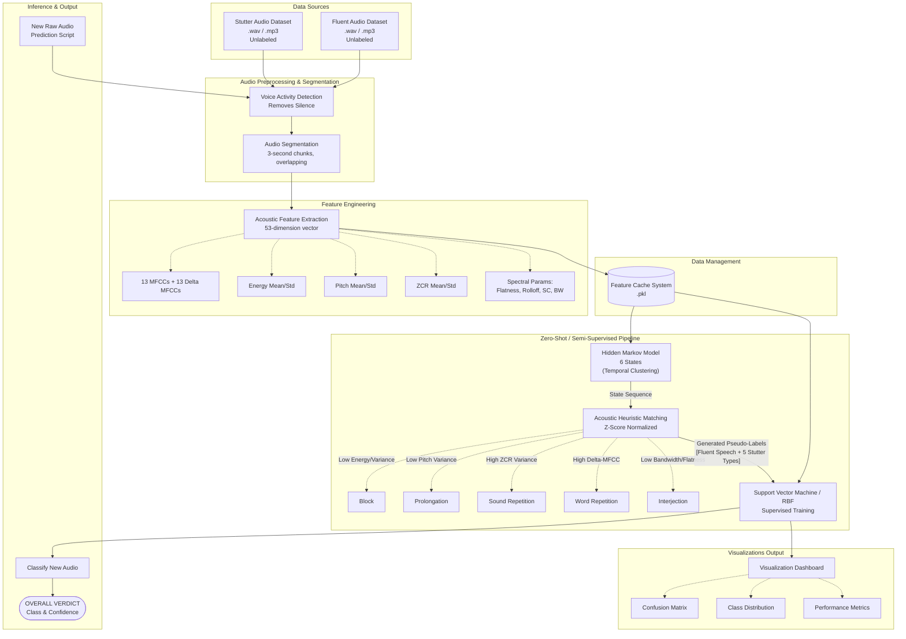

# Stuttering Detection System Architecture

This diagram illustrates the complete end-to-end data flow and processing pipeline for the semi-supervised stuttering detection system, from raw audio input to the final classified output.

## Full System Architecture

## Key Components:

1.  **Preprocessor ([data_preprocessing.py](file:///d:/semi%20supervised/data_preprocessing.py), [segmentation.py](file:///d:/semi%20supervised/segmentation.py))**: Responsible for unifying sample rates to 16kHz, running robust Voice Activity Detection (VAD) to trim non-speech segments, and slicing the continuous audio into precise 3-second overlapping segments.
2.  **Feature Extractor ([feature_extraction.py](file:///d:/semi%20supervised/feature_extraction.py))**: Transforms the raw waveforms into rich, 53-dimensional representations using Librosa. It extracts MFCCs, Delta-MFCCs, energy, pitch, ZCR, and multiple spectral characteristics required to distinguish subtle stutter types.
3.  **Caching Mechanism ([feature_cache_manager.py](file:///d:/semi%20supervised/feature_cache_manager.py))**: Saves heavily processed feature matrices to disk using cryptographic hashing so that redundant audio extraction is skipped on subsequent runs.
4.  **Temporal Modeler ([hmm_training.py](file:///d:/semi%20supervised/hmm_training.py))**: Uses an unsupervised Hidden Markov Model with Gaussian Mixture Models (HMM-GMM) to find natural hidden states and clusters in the unlabeled speech sequences based entirely on acoustic similarities.
5.  **Acoustic Labeler ([pseudo_labeling.py](file:///d:/semi%20supervised/pseudo_labeling.py))**: Applies robust heuristics via Z-Score normalization. It interprets the HMM temporal clusters dynamically and scores each distinct segment to rigorously assign them to one of the 5 recognized stutter types (or Fluent Speech).
6.  **Classifier ([svm_classifier.py](file:///d:/semi%20supervised/svm_classifier.py))**: A standard supervised model (Support Vector Machine) using an RBF kernel that trains directly on the labels generated by the HMM step, acting as the final, highly accurate inference engine capable of classifying external audio.
